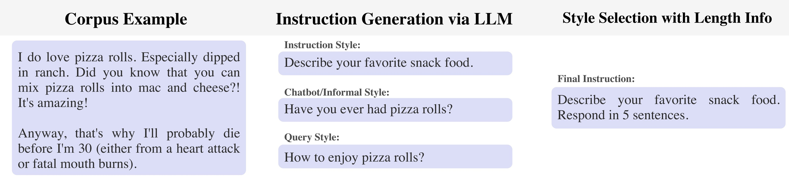
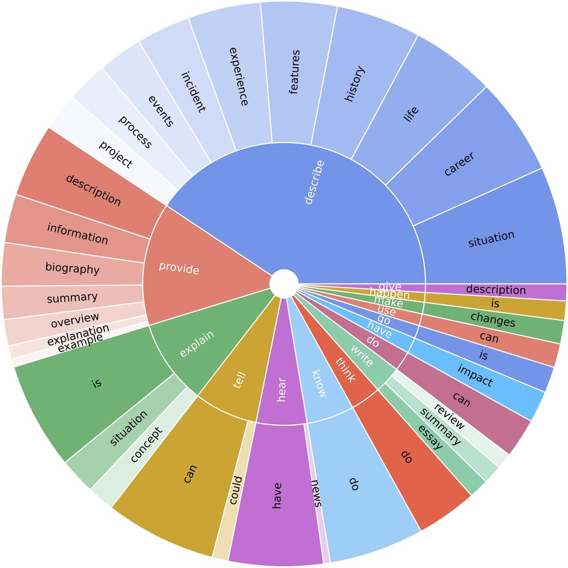

# The LongForm Dataset
## Pipeline
The process of creating LongForm from corpus
		examples. After collecting diverse examples
		from corpora, LLMs generate relevant
		instructions through zero-shot prompting in
		various styles. The final instruction is
		generated by selecting one of three styles
		(instruction (as in this case), informal chatbot,
		search engine query) and
		optionally including length
		information.

## Distribution
The distribution of the LongForm dataset in terms of the source of examples is below. It contains examples generated from raw text corpora via LLMs, structured corpus examples, as well as various NLP task examples such as email writing, grammar error correction, story/poem generation, and text summarization.
| **Type**               | **Source**     | **Number of Examples** |
|------------------------|----------------|------------------------|
| **Corpora**            | C4             | 10,000                 |
|                        | Wikipedia      | 5,000                  |
| **Structured Corpora** | Stack Exchange | 4,380                  |
|                        | WikiHow        | 2,500                  |
| **Tasks**              | NIv2           | 3,684                  |
|                        | Big Bench      | 600                    |
|                        | BEA-GEC        | 1,203                  |
|                        | Enron          | 372                    |
| **Total**              |                | 27,739                 |
|  |   |  |
| **Train**              |                | 23,652                 |
| **Validation**         |                | 2,042                  |
| **Test**               |                | 2,045                  |

## Diversity
Most common verb and noun/auxiliary verb pairs of generated instructions from the corpora subset of the LongForm dataset. 

